[TOC]

------

# 概述

虚幻引擎可以通过DMX插件用于现场活动和永久性数字装置。

Artnet和sACN是允许通过以太网（IP）聚合和发送DMX数据的网络协议。Artnet允许通过单根网线发送32,768个域。尽管Artnet是较旧的协议，但受到更多设备的支持。sACN（控制网络的流送架构）当前似乎更流行，允许通过单根网线运行63,999个DMX数据域。

DMX协议可以用于提供给蓝图节点和灯具类型Actor的输入中，以便实现现场演出舞台的快速预可视化。实时DMX输入用于在3D UE关卡中驱动和控制已启用灯具。适当的光照属性可用于实现逼真效果，以便演出设计师在其创作过程中进行迭代。

**显示预可视化**

DMX协议可以用于提供给蓝图节点和灯具类型Actor的输入中，以便实现现场演出舞台的快速预可视化。实时DMX输入用于在3D UE关卡中驱动和控制已启用灯具。适当的光照属性可用于实现逼真效果，以便演出设计师在其创作过程中进行迭代。

**设备控制**

DMX协议输出和蓝图节点可用于与启用DMX的灯具和设备进行通信，从而可以通过UE控制光照控制台或设备。

**内容触发器**

DMX协议输入可用于触发UE中的现场效果或动画序列，这些效果或动画序列将与光照灯具控件一起在现场演出中显示。

## 什么是DMX？

DMX是数字通信网络标准，通常用于控制舞台灯光和效果。DMX最初用作控制调光器的标准方法，在DMX512之前，它已采用各种不兼容的专有协议。很快，它成为了连接控制器（例如照明控制台）与调光器和特效设备（例如烟雾机和智能灯）的主要方法。

DMX还扩展到非剧场室内和建筑光照应用中，从圣诞灯串到电子公告板，使用范围广泛。DMX现在几乎可以用来控制一切，它在剧院和现场都很受欢迎。

虽然DMX主要用于控制光照设备，但可以使用DMX协议驱动许多其他形式的硬件，包括以下内容。

- 特殊效果硬件
  - 雾化器
  - 烟花
  - 激光
  - 二氧化碳喷射炮
  - 火焰炮
  - 五彩纸屑发射器
  - 等等。
- 电机
- 电源开关
- 微控制器
- 等等。

## DMX数据

DMX可以被视为从一个位置（我们的源）发送到另一个位置（或目的地）的数字信息包。每个包都创建于某个源，其中包含应由某些收件人接收和读取的特定信息。每个数据包的结构经过精心设计，如果你想进一步了解其硬件级别工作原理，请阅读[ESTA标准](https://tsp.esta.org/tsp/documents/docs/ANSI-ESTA_E1-11_2008R2018.pdf)。就我们而言，我们仅关注其中包含的数据。每个包包含一个512字节的数组或0-255范围内的值。

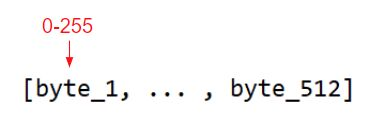

## 关于DMX的技术详情

为DMX创建虚幻引擎插件将实现以下内容：

1. 两种协议（ArtNet和sACN）的双向本地DMX通信。
2. 完整的蓝图节点库。
3. 一个初步UI，用于描述和构建控制器、灯具类型和实际设备的库。

DMX需要两个主要组件才能运行：

1. DMX控制器或DMX源。
2. 至少一个DMX灯具（通常是光照灯具，但可以是受DMX协议控制的任何类型的设备）。

## DMX控制器

DMX控制器（也称"节点"）充当信号源或创建DMX信号的位置。此外，控制器还充当一组菊花链灯具的数据分发器。DMX控制器可以采用两种形式：**USB/网络接口设备** 或 **标准DMX控制台**。

1. USB/网络接口将USB信号或IP数据包转换为DMX，然后将其发送到一组菊花链DMX灯具中。
   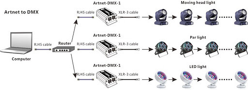
2. DMX控制台允许用户手动触发传出DMX，并且基于控制台的功能，还可能从网络数据包接收和广播DMX。
   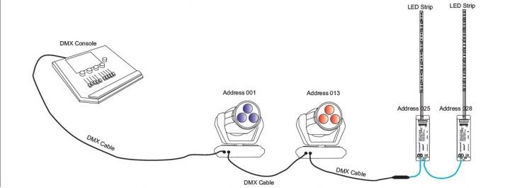

## DMX灯具

实际上，DMX灯具是负责根据接收到的数据接收和执行命令的设备。这可能意味着打开或关闭光源或将设备旋转90度。DMX灯具有很多种，从简单开关的标准舞台灯到可以多方向旋转和具有滤光器的智能灯。

每个灯具都有一组在硬件级别上预定义的属性/命令。这些属性划归到各个名为 **odes** 的组中。许多灯具包含多种模式，这些模式预定义了灯具将响应的可用属性。

灯具制造商为用户提供了不同的模式选项，以便他们可以适应各种用例，包括尽可能多的功能，同时允许用户选择对自己最重要的功能。这样形成了最简单、最小的信道计数模式；复杂、庞大的信道模式；以及一些中间模式。在专业光照实践中，很多时候都会选择中间模式，以在功能和易控制性之间取得平衡，并更加节俭地使用DMX信道数。

每种模式都包含一组属性。属性负责告知硬件如何响应收到的DMX数据。在大多数情况下，你可以在设备随附的灯具手册中找到特定灯具的所有属性。

请查阅[DMX灯具](https://docs.unrealengine.com/5.0/zh-CN/dmx-fixtures-in-unreal-engine)了解详情。

## 域

**域** 由一组串在一起的灯具组成，它们读取相同的数据。一个域包含512字节的信息，因此域中灯具的数量将取决于寻址每个灯具所需的数据字节数。

## 信号通信

每个控制器负责一个或多个域，每个域都以长串菊花链的形式串接多个灯具。可以将域视为一组已寻址灯具的标识形式。为了将数据发送到相应的灯具，你还需要将其发送到正确的域。

控制器接收到分发DMX数据包的命令后，将定位相应的域，并沿着灯具链发送数据包，以供每个已连接灯具接收和解译。每个灯具接收相同的数据包，并且如果该数据包包含适用于该灯具的任何数据，则执行内部命令。读取数据后，将其沿链向下传递到下一个灯具，重复该过程。为了确保灯具接收正确的信息，它必须侦听正确的数据。这里引入了灯具寻址或**"配接"**概念。

### 灯具配接

灯具配接（Fixture Patching）的概念源自这一理念：即我们需要能够沿通讯链虚拟放置灯具，以便接收相应的数据。由于我们发送了要由多个灯具读取的完整数据包，因此重要的是要设法准确识别该包中应读取和解译的字节和应忽略的字节。这一点通过在域中的特定起始地址处指定每个灯具完成。起始地址范围为1到512（我们的DMX数据包中的最大值）。通过将灯具分配给特定的起始地址，它会占用从指定起始地址到该起始地址加上灯具在其当前模式下包含的属性数量的一系列地址。

请参阅以下示例：
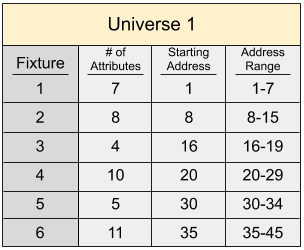

**灯具2** 当前模式 = 8ChannelMode（包含 **8** 种属性）

1. 红（地址8）
2. 绿（地址9）
3. 蓝（地址10）
4. 频闪（地址11）
5. 平移（地址12）
6. 倾斜（地址13）
7. 调光器（地址14）
8. 宏（地址15）

**起始地址** = 8 

**地址范围** = 8 - 15

使用上面的示例，为了进行平移，灯具将侦听地址12，以便获取0-255之间的字节值，这将最终控制灯具在其定义的旋转范围内平移的数量。

### 属性分辨率

最常见的情况是，属性将使用单个字节的输入范围（例如0-255）。有时，需要更高的分辨率实现更高精度的运动或光照控制。在这种情况下，属性采用更大的输入范围，该范围由多个字节而不是一个字节构成。多个字节的组合可能导致控制特定属性的值更高。下面是可能的属性信号类型。

1. **8位属性** - 最小值：0，最大值：255 - 占用1个地址
2. **16位属性** - 最小值：0，最大值：65,536 - 占用2个地址
3. **24位属性** - 最小值：0，最大值：16,777,215 - 占用3个地址
4. **32位属性** - 最小值：0，最大值：4,294,967,296 - 占用4个地址

当需要超过8位的属性时，该属性在域中占用多个地址。根据分辨率情况，它可以占用多个连续的地址。你可以在上面的列表中看到属性将占用的地址数量。

## DMX网络通信

DMX数据可以通过多种方式发送，包括通过USB、IP数据包发送以及直接从控制台发送。在过去的几年中，网络通信方法变得日益流行和重要。随着演出变得越来越大型，灯具数量增加，用户越来越需要以快速、高效和可靠的方式处理更多灯具。

为了克服DMX的信道限制，同时仍然利用DMX的结构，以太网协议应时而生。这些协议允许使用以太网技术通过单根Cat5电缆传输多个DMX域。在DMX插件中，有两种使用最广泛且UE支持的主要以太网协议：Art-Net和sACN。

### Art-Net

Art-Net是买断式授权通信协议，用于通过UDP传输DMX512-A光照控制协议和远程设备管理（RDM）协议。它用于在"节点"（例如，智能光照设备）和"服务器"（运行光照控制软件的光照台或通用计算机）之间进行通信。

[^Note]: 可以在[art-net网站](https://art-net.org.uk/structure/the-technology/)上找到有关Art-Net协议的更多详细信息。

### sACN

控制网络的流送架构（sACN）是ESTA开发的一种标准协议，用于通过网络有效传输DMX域。它在很多方面都可以和ArtNET匹敌。优势是多播选项支持非常简易的配置。sACN是用于控制大量RGB LED的流行协议。

## DMX调制器

DMX调制器（DMX Modulator）是一种数据处理和转换功能，可用于入站或出站的DMX数据。

### 输入调制器

输入调制器（Input Modulator）可在细节面板的灯具设置（Fixture Settings）中指定。你可以根据需要添加任意数量的调制器。以下是输入调制器的选项：

- **无（None）：** 不应用数据操作或转换。
- **CMY到RGB（CMY to RGB）:** 从CMY到RGB的颜色转换。
- **固定帧延迟（Constant Frame Delay）:** 将传出的DMX数据按指定的帧数延迟。
- **额外属性（Extra Attributes）:** 在像素映射单元上设置额外属性。
- **RGB到CMY:** 从RGB到CMY的颜色转换。

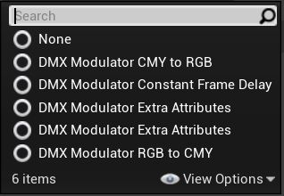

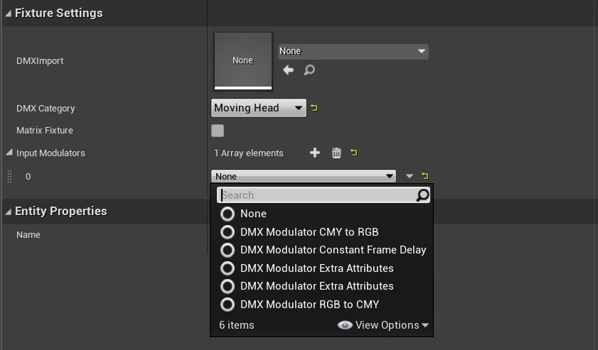

### 输出调制器

输出调制器在[Pixel Mapping](https://docs.unrealengine.com/5.0/zh-CN/dmx-pixel-mapping-in-unreal-engine)面板中指定。以下是输出调制器选项的列表。

- **无（None）：** 不应用数据操作或转换。
- **CMY to RGB：** 将"CMY到RGB颜色转换"应用于实时输入纹理RGB像素。
- **额外属性（Extra Attributes）：** 设置额外属性（未由实时输入纹理驱动）。
- **额外单元属性（Extra Cell Attributes）：** 设置每个单元的额外属性（未由实时输入纹理驱动）。
- **像素映射帧延迟（Pixel Mapping Frame Delay）：** 将输出的DMX数据按照指定帧数延迟。
- **RGB到CMY：** "RGB到CMY颜色转换"用于实时输入纹理RGB像素。

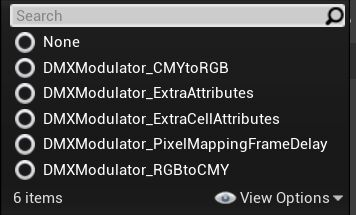

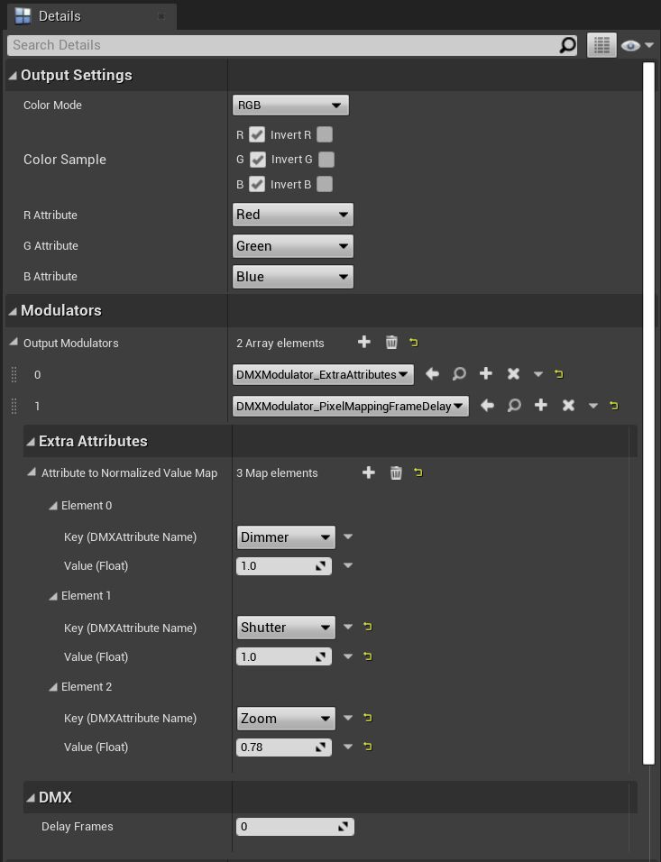

## 功能指南

这是DMX插件中所有功能的详细列表。

### 从虚幻引擎发送DMX数据（ArtNet+sACN协议）

- 已实现两种主要的DMX通信协议（ArtNet和sACN），可通过以太网将DMX发送到60,000多个域。
- 可以在运行时和编辑器中直接从虚幻引擎发送DMX。

### 接收传入的DMX信号

用户可以创建获取者（getter）蓝图，以允许从任何域中的任何信道接收DMX数据。一系列委托事件和将返回当前灯具值数据的DMX组件可用于使用传入的DMX数据。这些事件可以应用于任何Actor（例如灯具），并使用传入数据控制旋转、色彩等。

### 用属性名称和信道映射注册DMX灯具

用户可以使用任意数量的信道将任何DMX灯具添加到他们的项目中。如果[灯具数据库](https://gdtf-share.com/)中没有预设灯具，则用户可以注册自己的灯具。用户还可以设置信道映射并注册自己的属性，以便最终在自己的自定义蓝图或所提供的默认灯具蓝图Actor中使用。

### 通过域和协议分配注册DMX控制器

用户将能够添加负责任何DMX域范围的不同DMX控制器。

### 从蓝图属性发送DMX

动态蓝图节点允许用户为特定的DMX灯具执行预先注册的灯具属性。

### 使用虚拟输出控制台从编辑器控制DMX

用户可以使用自定义DMX控制台窗口直接从编辑器测试任何域中的任何信道或任何范围的信道。

### GDTF集成

[VectorWorks](https://www.vectorworks.net/en-CA)支持[GDTF](https://gdtf-share.com/?cont=what)文件格式标准，因此可以导入许多带有自身属性的灯具类型。目前只支持导入属性。[Spotlight](https://www.vectorworks.net/en-CA/spotlight)是他们用于现场演出预可视化的软件，已在业界广泛使用。

# DMX快速入门

## 启用DMX插件

要在项目中启用DMX插件，请导航至 **编辑（Edit）** > **插件（Plugins）** 并启用以下插件。

- DMX Runtime
- DMX Protocol

### 步骤

1. 前往 **新增（Add New）** > **DMX** > **DMX库（DMX Library）**，创建新的DMX库。

2. 打开新创建的DMX库，然后导航到 **控制器（Controllers）** 面板。

   1. 点击左上方的绿色 **新控制器（New Controller）** 按钮，添加控制器。
      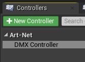
   2. 选择所需协议和 **通信模式（Communication Mode）**。
      1. **协议**：Art-Net或sACN
      2. **通信模式**：广播或单播
         1. 创建具有多个用于组播的单播IP的数组。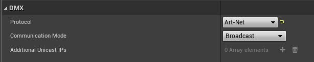
   3. 在物理控制器上设置所需的 **域范围（Universe Range）**。
      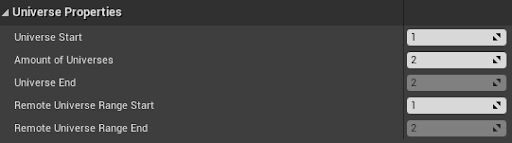

3. 导航到 **灯具类型（Fixture Types）** 面板，并通过点击绿色的 **新灯具（New Fixture）** 类型按钮添加新的灯具类型。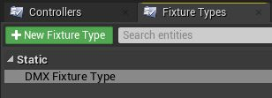

4. 导入GDTF资产，以便自动配置灯具类型或按如下所述手动配置。
   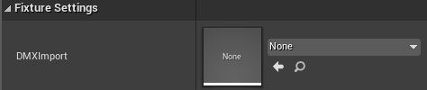

   1. **模式**
      1. 使用 **+添加模式（+ Add Mode）** 按钮添加模式。
         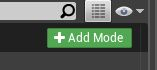
      2. 设置 **模式属性（Mode Properties）**。
         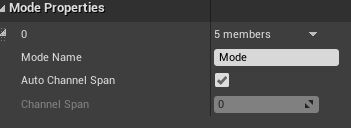
   2. **属性**
      1. 使用 **+添加功能（+ Add Function）** 按钮添加此模式的所有所需功能。
         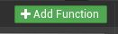
      2. 设置每个函数的关联属性。
         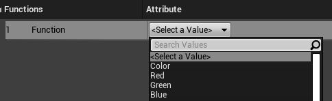
      3. 设置所需属性。
         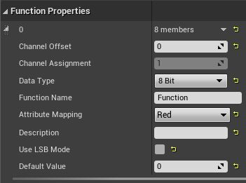

5. 导航到 **灯具配接（Fixture Patch）** 面板，并点击绿色的 **添加灯具（Add Fixture）** 按钮添加新的内容包，然后选择要从中创建新配接的灯具类型。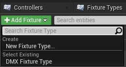

   1. 确保设置你的 **域ID（Universe ID）**、**开始信道（Starting Channel）** 和 **激活模式（Active Mode）** 以便分别与你的物理控制器和物理灯具上的设置相匹配。
      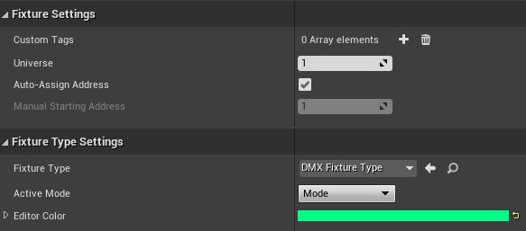
   2. 右侧的 **配接查看器（patch visualizer）** 将指示指定域中当前分配配接的位置。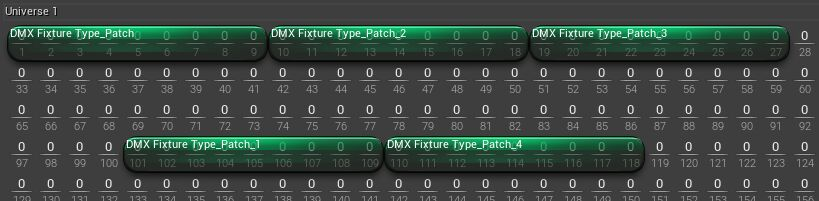

6. 为了测试DMX的输出是否正常工作：

   1. 打开 **输出控制台（Output Console）**。
      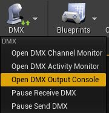
   2. 创建新增益调节器。
      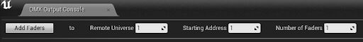
   3. 上下拖动滑块以便测试输出。
      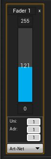

7. 接下来，要查看特定域的传出和传入 **DMX信号**，请打开 **信道监视器（Channel Monitor）** 或 **活动监视器（Activity Monitor）**。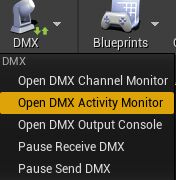

   [^Note]: 设置你要监视的协议和域，然后在虚幻引擎或从外部程序中广播一些DMX。你将在此处看到实时更新。

   如果使用外部程序，请确保你已连接到同一网络，并且广播到网卡的IP子网。有关更多信息，请参见"接收DMX"分段。

8. 要创建自定义灯具并将其置于场景中：

   1. 请导航到 **DMX灯具（DMX Fixtures）** 插件文件夹，找到灯具模板，并创建一个子Actor类或重复的Actor类。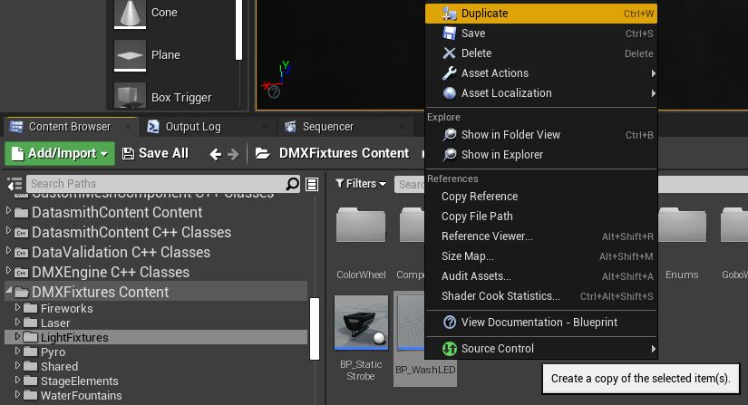

   2. 将新Actor类拖放到视口中，即可将该新Actor类添加到场景。

   3. 设置DMX库和灯具配接。

      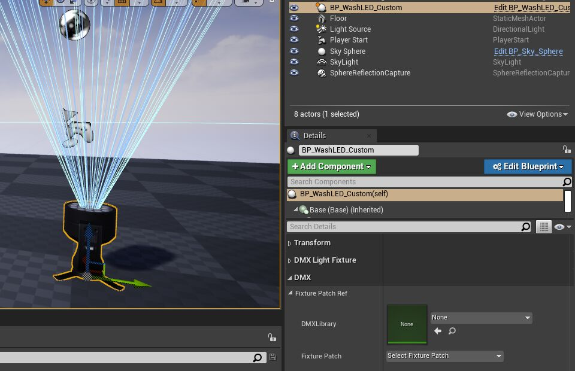

   
   

   