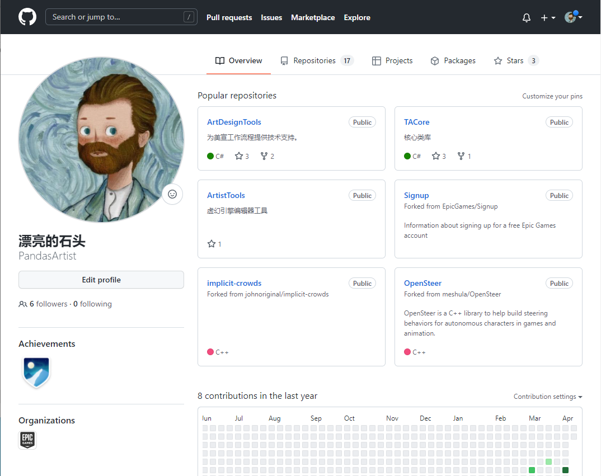

**Repository**：简称Repo，可以理解为“仓库”，我们的项目就存放在仓库之中。也就是说，如果我们想要建立项目，就得先建立仓库；有多个项目，就建立多个仓库。

**Issues**：可以理解为“问题”，举一个简单的例子，如果我们开源一个项目，如果别人看了我们的项目，并且发现了bug，或者感觉那个地方有待改进，他就可以给我们提出Issue，等我们把Issues解决之后，就可以把这些Issues关闭；反之，我们也可以给他人提出Issue。

**Star**：可以理解为“点赞”，当我们感觉某一个项目做的比较好之后，就可以为这个项目点赞，而且我们点赞过的项目，都会保存到我们的Star之中，方便我们随时查看。在 GitHub 之中，如果一个项目的点星数能够超百，那么说明这个项目已经很不错了。

**Fork**：可以理解为“拉分支”，如果我们对某一个项目比较感兴趣，并且想在此基础之上开发新的功能，这时我们就可以Fork这个项目，这表示复制一个完成相同的项目到我们的 GitHub 账号之中，而且独立于原项目。之后，我们就可以在自己复制的项目中进行开发了。

**Pull Request**：可以理解为“提交请求”，此功能是建立在Fork之上的，如果我们Fork了一个项目，对其进行了修改，而且感觉修改的还不错，我们就可以对原项目的拥有者提出一个Pull请求，等其对我们的请求审核，并且通过审核之后，就可以把我们修改过的内容合并到原项目之中，这时我们就成了该项目的贡献者。

**Merge：**可以理解为“合并”，如果别人Fork了我们的项目，对其进行了修改，并且提出了Pull请求，这时我们就可以对这个Pull请求进行审核。如果这个Pull请求的内容满足我们的要求，并且跟我们原有的项目没有冲突的话，就可以将其合并到我们的项目之中。当然，是否进行合并，由我们决定。

**Watch：**可以理解为“观察”，如果我们Watch了一个项目，之后，如果这个项目有了任何更新，我们都会在第一时候收到该项目的更新通知。

**Gist：**如果我们没有项目可以开源或者只是单纯的想分享一些代码片段的话，我们就可以选择Gist。不过说心里话，如果不翻墙的话，Gist并不好用。

- workspace：工作区
- staging area：暂存区/缓存区
- local repository：版本库或本地仓库
- remote repository：远程仓库

## Git 常用命令介绍

### 创建仓库命令

| 命令        | 说明                                   |
| :---------- | :------------------------------------- |
| `git init`  | 初始化仓库                             |
| `git clone` | 拷贝一份远程仓库，也就是下载一个项目。 |

## 提交与修改

| 命令         | 说明                                     |
| :----------- | :--------------------------------------- |
| `git add`    | 添加文件到暂存区                         |
| `git status` | 查看仓库当前的状态，显示有变更的文件。   |
| `git diff`   | 比较文件的不同，即暂存区和工作区的差异。 |
| `git commit` | 提交暂存区到本地仓库。                   |
| `git reset`  | 回退版本。                               |
| `git rm`     | 删除工作区文件。                         |
| `git mv`     | 移动或重命名工作区文件。                 |

### 提交日志

| 命令               | 说明                                 |
| :----------------- | :----------------------------------- |
| `git log`          | 查看历史提交记录                     |
| `git blame <file>` | 以列表形式查看指定文件的历史修改记录 |

### 远程操作

| 命令         | 说明               |
| :----------- | :----------------- |
| `git remote` | 远程仓库操作       |
| `git fetch`  | 从远程获取代码库   |
| `git pull`   | 下载远程代码并合并 |
| `git push`   | 上传远程代码并合并 |

**git init**：初始化仓库。

**git add**：添加文件到暂存区。

**git commit**：将暂存区内容添加到仓库中。

**git clone**：拷贝一份远程仓库，也就是下载一个项目。

**git status**： 查看仓库当前的状态，显示有变更的文件。

**git diff**：比较文件的不同，即暂存区和工作区的差异。

**git reset**：回退版本。

**git rm**：删除工作区文件。

git mv：移动或重命名工作区文件。

**git log**：打印 Git 仓库提交日志

**git branch**：查看 Git 仓库的分支情况

**git merge**：将a分支合并到master分支

**git branch -d & git branch -D**：删除a分支  & 强制删除

**git tag**：为当前分支添加标签