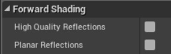

---

title:  "Oculus Quest 2 开发与优化"
date:   2022-04-8 9:24:09 +0800
categories: jekyll update
---

[TOC]

------

# 简述

[Oculus Quest 2 ](https://www.oculus.com/) 是 [Meta](https://www.facebook.com/)（原名Facebook）发行、于2020年10月上市的VR头盔。

Oculus Quest 2采用纯白色机身设计，重503克，机身采用全塑料材质，头戴材料为布质。采用弹性头带，两边的小型定向扬声器设在头带安装处。

Oculus Quest 2使用LCD屏，采用高通Snapdragon XR2处理器，搭载6GB运行内存和64GB/256GB两个存储版本。采用单眼1832*1920显示屏分辨率，支持72赫兹和90赫兹的刷新率。

# 配置参数

|     项目     |                  内容                   |
| :----------: | :-------------------------------------: |
|    处理器    | 高通Snapdragon XR2(高通®骁龙™ XR2 平台) |
|   运行内存   |                   6GB                   |
|   存储版本   |            64GB/128GB/ 256GB            |
| 显示屏分辨率 |             单目 1832*1920              |
|    刷新率    |              72赫兹/90赫兹              |
|     重量     |                  503克                  |
|     屏幕     |                  LCD屏                  |

# 开发设置

## (ODH)Oculus Developer Hub 环境配置

> [Oculus开发者中心](https://developer.oculus.com/documentation/native/android/mobile-intro/) 
>
> [项目分享及发布](\\192.168.100.199\home\Markdown\项目分享及发布.md )

1. 参考 `项目分享及发布` ,配置Android 环境.

2. 安装 **Oculus Developer Hub**，登陆开发者（FB）账号。

   | 软件                                                         | 版本                          |
   | ------------------------------------------------------------ | ----------------------------- |
   | [Oculus 客户端](\\192.168.100.199\home\Markdown\Software\OculusSetup.exe) | 38.0.0.51.727 (38.0.0.51.727) |
   | [Oculus Developer Hub](\\192.168.100.199\home\Markdown\Software\Oculus Developer Hub Setup 2.2.0.exe) | 2.2.0                         |

3. TpyeC / USB 链接Oculus 和PC，PC需要有蓝牙功能，并且只在第一次添加时需要蓝牙。

4. 打开 Oculus Developer Hub ->Device Manager 添加设备。

## 虚幻中项目设置

> [Oculus开发者中心 Unreal Engine](https://developer.oculus.com/documentation/unreal/unreal-quick-start-guide-quest/) 
> VR模版 https://docs.unrealengine.com/5.0/zh-CN/vr-template-in-unreal-engine/

1. 更改 Preview Rendering Level 为 **Android ES3.1**

2. 根据以上参考设置项目,注意设置 **Start In VR** = true 和 **Package for Oculus Mobile Devices**
   

   

3. 修改包名,**Adnroid Package Name**
   

3. 启用前向着色
   
   启用前向着色渲染器的步骤：
   
   1. 在 **Edit** 菜单中打开 **Project Settings**。
   2. 选择左边的 **Rendering** 标签并找到 **Forward Shading** 类目。
   3. 启用 **Forward Shading**。
   
5. 启用多重采样抗锯齿
   使用多重采样抗锯齿（MSAA）的步骤：

   1. 在 **Edit** 菜单中打开 **Project Settings**。
   2. 选择左边的 **Rendering** 标签并找到 **Default Settings** 类目。
   3. 将 **Anti-Aliasing Method** 属性设为 **MSAA**。

6. 测试打包APK。

# 参考

# kizuna ai touch the beats 《again》绊爱

https://www.bilibili.com/video/BV1mS4y167M7/?spm_id_from=autoNext

#  项目优化

> OpenGL ES https://developer.android.com/guide/topics/graphics/opengl

## 优化目标

- **FPS**
   帧率：保持稳定的72帧。
- **Triangles drawn**
  三角面：保持在20万面以内。
- **DrawPrimitiveCall**
  DC：150以内。

## 已验证功能

- [x] KawaiiPhysics：物理引擎插件
- [x] PBR 
  Mobile 模式的 OpenGL ES 3.1与PC的 Shader Model 5 模式有差别。需要针对 Mobile 的视觉效果进行调整。

> 前向着色渲染器 https://docs.unrealengine.com/4.26/zh-CN/TestingAndOptimization/PerformanceAndProfiling/ForwardRenderer/
>
> 双端基础渲染效果对比 https://zhuanlan.zhihu.com/p/70286099

## 前向渲染

> 前向渲染与延迟渲染的选择 http://imgtec.eetrend.com/blog/2020/100049068.html

**什么是前向渲染（Forward Rendering）？**

Forward Rendering是一种被大多数引擎所使用的比较传统的渲染技术，显卡（GPU）通过将应用程序阶段（CPU）所传递给它的Geometry拆解成顶点，并将其变换（transformed）和分解成为片段（fragment）或者像素，从而进入显示到屏幕前的最后的渲染操作阶段（final rendering treatment）。前向渲染的一个典型特征是一个几何体（Geometry）从传入显卡进行处理到最后屏幕显示图形的整个过程是不间断的，它是一个线性的处理过程。

**什么是延迟渲染（Deferred Rendering）？**

Deferred Rendering 的 延迟二字表明了我们从Geometry到RenderTarget的处理过程不是连续的，它会将所有的Geometry从渲染管道（Render Pipe：VS->GS）输出后（输出到Geometry Buffer，也就是我们常说的G-Buffer），然后通过应用着色（applying shading）得到最后的图像。

光照计算是**前向渲染**和**延迟渲染**最主要的区别。

如果你需要渲染光源非常复杂的场景，那么建议使用Deferred Rendering，但是同时，延迟渲染也有一些重大的缺陷：

- 首先我们上面提到延迟渲染的工作原理，它将geometry通过MRT渲染到屏幕空间，MRT在老式的显卡上是不被支持的，所以在使用这项技术的时候，应该要明确显卡是否支持MRT。
- Deferred Rendering需要比较大的带宽（bandwidth）。老式的显卡或许并不具备这种大的带宽的传输能力。
- 不能使用透明的物件（transparent object）。除非你在使用Deferred Rendering渲染不透明物件的同时，使用Forward Rendering的方式渲染透明的物件。为什么Deferred Rendering不能渲染透明的物件呢？因为Deferred Rendering它需要对物件依据深度进行排序，只能处理显示在最前面的像素，无法对透明物件进行Alpha Blend。
- Deferred Rendering不支持抗锯齿（anti-aliasing）。某些引擎可能会使用edge detection，FXAA等方法解决该问题。
- Deferred Rendering只允许存在一个材质。除非使用Deferred Rendering的一个变种Deferred Lighting。
- 由于阴影（Shadows）的表现依赖于光源的数量，Deferred Rendering对此支持并不好。

​	虚幻引擎默认使用延迟渲染器，因为它的功能最全面，渲染功能更多。 然而，延迟渲染器存在一些权衡，可能不适用于所有 VR 项目。

​	 **前向渲染** 提供更快的基线和更快的渲染通道，可在 VR 平台拥有更好的性能。 前向渲染不仅速度更快，相较于延迟渲染器它还拥有更多抗锯齿选项，带来更为	清晰明快的显示效果。

​	前向渲染器支持 **MSAA** 和临时抗锯齿（TAA）,使用 **MSAA**（替代 TAA）

[^Note]: 可使用控制台变量 `r.MSAACount` 控制每个像素计算的 MSAA 采样数。`r.MSAACount 1` 会关闭 MSAA。 指定 `r.MSAACount 0` 将退回使用 TAA，可在抗锯齿方法之间便利地进行切换。

进行一些渲染时，前向渲染器的速度比延迟渲染器更快。可在每个材质上禁用的功能可以实现最大的性能提升。 默认情况如下：只有最近的反射捕捉应用时不带视差矫正，除非材质使用高精度反射、高度雾按每个顶点计算、平面反射只应用到启用的材质上。

### 支持的功能

此列表中包含前向渲染器当前支持的功能：

- 完全支持静态光照。包括来自可移动物体的动态阴影（此阴影将和预计算环境阴影混合）
- 混合多个反射捕捉（带视差矫正）
- 部分场景的平面反射（合成到反射捕捉中）
- DBuffer 贴图
- 预计算的光照和天空光照
- 无阴影的可移动光照（任意数量）
- 胶囊体阴影
- 遮罩材质的透明覆盖
- 兼容实例化立体
- 最多 4 个重阴影投射可移动光照
- 阴影投射光照上的光照函数

### 已知问题和常见问题

**不支持** 前向渲染器的以下功能：

- 屏幕空间技术（SSR、SSAO、接触阴影）
- 动态阴影半透明度
- 从静态光照获取环境阴影的半透明度
- D-Buffer 贴图和动态模糊上的 MSAA

### 以下是使用前向渲染器时的常见问题。

- **切换到前向渲染器时材质出错，是不是 GBuffer 场景纹理存在问题？**
  - 前向渲染器中，纹理采样无法访问 GBuffer（只能在延迟渲染器中访问）。
- **前向渲染器允许的纹理样本数量是否比延迟渲染器少？**
  - 前向渲染器将所有功能打包到一个着色器中，因此材质可用的纹理采样器更少。
  - 通常使用共享采样器即可解决此问题。
- **为什么 MSAA 出现问题，无法找到大气层雾的样本？**
  - 大气层雾暂时无法处理 MSAA。
  - 对高度雾而言，可使用顶点雾生成（Vertex Fogging）解决问题（启用前向着色后将自动启用该项）。
  - 这意味着它将在前向基础通道中进行计算，并获得正确的抗锯齿。
  - 大气仍在尚未测试的场景深度的延迟通道中计算，因此无法正确进行抗锯齿（有望在之后的版本中得到修复）。

## 纹理采样（Texture Smaplers）

- 尽可能减少纹理的使用。

  > 由于硬件限制，只能使用16个纹理采样器。4.23版已经弃用了OpenGL ES2。更早版本的虚幻引擎只能使用5个纹理采样器。

  纹理的读取占用内存带宽、产生较高的功耗以及增加内存占用。

- 通过纹理打包来减少纹理数量。

  不要将单个纹理用于粗糙度或者金属度，而是将纹理打包到单个纹理的通道中。

- 不必要的参数，尽量不去使用纹理。
  比如金属度、粗糙度、平滑度等，使用参数控制， 而不是使用纹理。
  
- 应使用[自定义UV](https://docs.unrealengine.com/4.26/zh-CN/RenderingAndGraphics/Materials/CustomizedUVs)来避免依赖性纹理获取（纹理UV上没有数学运算）。

## 光照着色器（Default Lit）和无光照着色器（Unlit）

​	手机游戏中最常用的着色器是**光照着色器（Default Lit）**和 **无光照着色器（Unlit）**。

​	移动平台上的材质（特征级ES 3.1）使用与其他平台相同的基于节点的创建过程。几乎所有的材质输入都可用于移动材质，而且在移动平台上，材质的外观和行	为通常与在其他平台上相同。

- **底色（BaseColor）**
- **粗糙度（Roughness）**
- **金属感（Metallic）**
- **高光（Specular）**
- **法线（Normal）**
- **自发光（Emissive）**
- **折射（Refraction）**

​	使用无光照着色器可以减少使用的纹理数量，因为材质不受光线影响，不需要粗糙度或金属纹理。

​	**Unlit** 是最快和最节省性能的着色模型。如果目标是低端设备，请使用无光照着色器。

- 尽可能使用 **默认(Default Lit)**和**无光照(Unlit)**的着色模型**（Shading Model）**。
- 无光照着色模型不受光照影响，无需进行镜面反射、阴影等光照计算，仅输出自发光作为颜色。性能更佳。
- 仅在必要时使用透明。 半透明和遮罩材质的消耗极高。建议尽量使用[半透明材质](https://docs.unrealengine.com/4.27/zh-CN/RenderingAndGraphics/Materials/MaterialProperties/BlendModes)。

### 减少不必要的数学运算

​	我们在着色器中使用数学运算来自定义外观和行为。例如，乘法、加法、幂、下限和对数。
​	这些数学运算在性能成本方面并不相等；因此，我们需要注意它们的使用。一些成本更高的操作是 **sin、pow、cos、divide 和 noise**。加法和乘法等基本运算	通常更快。尽量减少昂贵的数学运算的数量。

### 移动平台不支持的功能

- 场景颜色表达式(**Scene Color expression**)
- 曲面细分输入(**Tessellation input**)
- 次表面散射着色模型(**Subsurface Scattering shading model**)

### 移动平台特定的材质设置

| 属性                                       | 说明                                                         | 备注                             |
| :----------------------------------------- | :----------------------------------------------------------- | -------------------------------- |
| **bFullyRough**                            | 启用后，可节省大量着色器ALU指令和一个采样器。这可以有效禁用高光（Specular），同时保持整体反射能量。 |                                  |
| **高质量反射（High Quality Reflections）** | 在前向渲染器中启用高质量反射。启用该设置可减少材质可用的采样器数量，因为反射立方体贴图将使用另外两个采样器。 |                                  |
| **bUseLightmapDirectionality**             | 禁用后，光照图中的光照将会比较平淡，但开销更低。             |                                  |
| **使用全精度（Use Full Precision）**       | 启用后，材质的着色器会使用移动设备上可用的最高精度数学。这可用于迂回解决低精度数学造成的渲染问题，例如世界坐标的使用或光滑材质之上的密集镜面反射 | 启用全精度着色器会提高材质开销。 |

## 纹理(Texture)

为移动平台创建纹理时，需要确保创建的纹理符合以下限制：

- 纹理各尺寸的最大大小仅为2048，因为这是PVR压缩器允许的最大大小。
- 纹理大小必须是2的幂（如2、4、8、16、32、64、128、256、512、1024或2048）。
  - 只要纹理大小保持为2的幂，可以有像512 x 64这样的非正方形纹理。
- 应尽量使用正方形纹理，因为它们能更有效地利用内存。

将纹理导入虚幻引擎4（UE4）时，需要向纹理应用以下纹理设置，以确保它们正确运行和操作：

- 建议在 **压缩设置（Compression Settings）** 中仅使用 **TC_Default** 或 **TC_NormalMap**，以帮助确保纹理占用尽可能少的内存。
- 应在所有纹理贴图上启用 **sRGB** 属性，法线贴图和遮罩除外。

大多数只有一层的不透明（非透明）材质只需要来自纹理的 **底色（Base Color）**、**粗糙度（Roughness）** 和 **法线（Normal）** 输入。所有其他输入，例如 **金属感（Metallic）**，都应使用 **Constant's Material Expression** 节点。下图显示了如何设置M_Metal_Steel材质中使用的纹理。

对于大多数只有一个图层的材质，如同上面显示的材质一样，应按照以下方式设置它们的纹理，因为它只需要两个纹理：

- **纹理1**
  - RGB中的BaseColor。
  - Alpha通道中的粗糙度。
  - 压缩被设置为 **默认值（Default）**（DX11上的DXT1/5、BC1/3）。
- **纹理2**
  - RGB中的法线贴图
  - 压缩被设置为 **Normalmap**（DX11上的DXT5、BC5）。

### 	纹理图集(Texture atlasing)

​		纹理图集是将多个较小的图像数据打包在一张较大的数据图像。使用多个Mesh 共享此纹理，而不是为每个Mesh 提供一个纹理。
​		在制作资源之前创建纹理图集，这样可以根据纹理图集对资产进行展UV。

### 	静态对象批处理

​		对使用同纹理和相同材质的静态对象进行批处理。可以减少DC。
​		批处理需要手动完成。3D软件中合并对象或者UE4 ActorMerging 执行批处理.
​		UE4 Actor Merging 工具还会自动创建纹理图集

### 	纹理过滤(Texture filtering)

​		纹理过滤是一种用于提高场景中纹理质量的方法。纹理过滤使效果看起来更好，但是也会降低性能，需要在性能和视觉之间找到平衡点。
​		纹理过滤最多可以占GPU能耗的一半，选择更简单的纹理过滤器可以降低程序的耗电量。
​		**常用的纹理过滤：**

- 最近（Nearest）。 近距离观察时，最近的过滤会使纹理看起来像块状。这是最简单和最便宜的纹理过滤。
- 双线性（Bi-linear）。使用双线性过滤，纹理在近距离变得更模糊。对最近的四个纹理像素进行采样，然后对其进行平均以为主像素着色。与最近过滤不同，双线性过滤会产生较少的块状像素，因为像素具有平滑的梯度
- 三线性（Tri-linear）。三线性过滤类似于双线性过滤，但在 mipmap 级别之间添加了混合。三线性过滤通过平滑 mipmap 之间的过渡来消除 mipmap 之间的显着变化。

​		**纹理过滤的最佳实践：**

- 使用双线性过滤在性能和视觉质量之间取得平衡。
- 有选择地使用三线性过滤。这是因为三线性滤波比双线性滤波需要更多的内存带宽。
- 过滤器的组合可能比使用三线性过滤器看起来和执行得更好。
- Texture mipmapping
  Mipmap 是以较低分辨率保存的原始纹理的副本。您可以将 mipmapping 视为相当于细节级别 (LOD)，但适用于纹理。
  在虚幻引擎中，要生成 mipmap，请使用 2 次方的纹理比率，例如 512x1024、128x128、2048x2048 等。当纹理比率不是 2 的幂时，虚幻引擎不会生成 mipmap 链。纹理不需要是正方形的，例如，虚幻引擎将为 512 x 1024 纹理生成 mipmap。

### 	纹理大小

- 只创建满足所需质量的纹理，尽可能最小。使用纹理图集在多个网格之间共享纹理也是最佳的实践。
- 纹理可以是不同的大小。减小需要较少细节的某些纹理的大小有助于减少带宽。例如，漫反射纹理可能是 1024x1024 像素，而粗糙度或金属贴图可能是 512x512 像素。
- 有选择地减小纹理大小，然后检查视觉冲击是否已经下降。

### 	纹理色彩空间

- 在 sRGB 颜色空间中使用漫反射纹理。
- 未作为颜色处理的纹理不得位于 sRGB 颜色空间中。示例包括金属贴图、粗糙度贴图和法线贴图。这是由于以下原因：
- 在这些贴图中使用 sRGB 会导致材质出现错误的外观或视觉效果。
- **注意：纹理的Inspector 窗口**中的**sRGB（颜色纹理）**设置不得勾选粗糙度、镜面反射、法线贴图或类似贴图。

### 	纹理压缩

​		使用 ASTC格式压缩

- ASTC 在与 ETC 相同的内存大小下提供更好的质量。
- ASTC 以比 ETC 更小的内存大小产生相同的质量。
- ASTC 的编码时间比 ETC 长。这意味着游戏打包过程可能需要更多时间。如果这是一个问题，那么最好在游戏的最终包装上使用 ASTC。
- ASTC 允许在质量方面进行更多控制，因为 ASTC 允许设置块大小。虽然块大小没有单一的最佳默认值，但将块大小设置为 5x5 或 6x6 像素是一个很好的起点。

### 	展UV

​		使 UV islands  尽可能笔直。

[^Note]:UV island 是纹理贴图中的一组连接的多边形。

- 打包 UV island 更容易，节省空间。

- 拉直UV可以减少纹理上发生的[阶梯效应。](https://en.wikipedia.org/wiki/Jaggies)

- 在移动平台上，纹理空间是有限的。这是因为移动平台上的纹理尺寸通常比游戏机或 PC 上的要小。良好的 UV 包装可确保您从纹理中获得最佳分辨率。

- 可能会考虑通过保持 UV 笔直来使 UV 略微扭曲，以便获得更好的整体纹理质量。

- **展UV**

  使 UV islands  尽可能笔直。

  [^Note]: UV island 是纹理贴图中的一组连接的多边形。

  保持 UV island 尽可能笔直的原因是：

  - 打包 UV island 更容易，节省空间。
  - 拉直UV可以减少纹理上发生的[阶梯效应。](https://en.wikipedia.org/wiki/Jaggies)
  - 在移动平台上，纹理空间是有限的。这是因为移动平台上的纹理尺寸通常比游戏机或 PC 上的要小。良好的 UV 包装可确保您从纹理中获得最佳分辨率。
  - 可能会考虑通过保持 UV 笔直来使 UV 略微扭曲，以便获得更好的整体纹理质量。

### 	视觉效果

- 创建纹理时只创建可以看到的细节，有效纹理。

- 烘焙环境光。

- 使用灰度纹理。

- **纹理通道打包**

  使用纹理通道将多个纹理打包为一个。节省纹理内存、减少纹理采样。

### 	Alpha通道

向纹理添加Alpha通道会使图像被转为32位格式，增加纹理文件大小，从而影响了整体带宽的占用。
使用纹理空闲的通道来存储Alpha Mask，可将纹理保持在16位，文件大小减半。

### 	法线贴图

- 通过法线贴图展现模型的更多细节。
- 法线贴图会有额外成本，因为法线贴图也是一种纹理，会有纹理读取操作，占用带宽，不过相对较小，相比效果还是值得的。
- 法线贴图烘焙。

## 网格（Mesh）

### 网格体类型

下面列出了移动平台上支持的所有网格体类型。**不支持其他类型的网格体。**

- [骨架网格体](https://docs.unrealengine.com/4.26/zh-CN/WorkingWithContent/Types/SkeletalMeshes)
- [静态网格体](https://docs.unrealengine.com/4.26/zh-CN/WorkingWithContent/Types/StaticMeshes)
- [地形](https://docs.unrealengine.com/4.26/zh-CN/BuildingWorlds/Landscape)
- [CPU粒子sprite、粒子网格体](https://docs.unrealengine.com/4.26/zh-CN/RenderingAndGraphics/ParticleSystems)

这些类型在移动平台上的[导入过程](https://docs.unrealengine.com/4.26/zh-CN/WorkingWithContent/Importing/FBX)或资源创建过程与在其他平台上是相同的。

### 网格体限制

由于硬件原因，移动平台上支持的网格体类型有一定的限制。

- 由于移动硬件不支持32位索引，所有网格体类型最多可以有65k个顶点。
- 骨架网格体最多可以有75个骨骼。

### 网格体优化工具

可使用以下工具来帮助优化UE4移动项目中使用的网格体：

- [创建和使用LOD](https://docs.unrealengine.com/4.26/zh-CN/WorkingWithContent/Types/StaticMeshes/HowTo/LODs) - 此教程展示如何在UE4中创建和设置LOD网格体。
- [每个平台的LOD](https://docs.unrealengine.com/4.26/zh-CN/WorkingWithContent/Types/StaticMeshes/PerPlatformLOD) - 此教程展示如何设置每个平台的LOD。 
- [每个平台的LOD屏幕大小](https://docs.unrealengine.com/4.26/zh-CN/WorkingWithContent/Types/StaticMeshes/HowTo/PerPlatformLODScreenSize) - 此教程展示如何调节每个平台的LOD过渡距离。
- [删除未使用的LOD](https://docs.unrealengine.com/4.26/zh-CN/WorkingWithContent/Types/StaticMeshes/HowTo/StripUnUsedLOD) - 此教程展示如何删除每个平台未使用的LOD。

用尽可能少的三角面来创建对象所需的质量。在为移动平台创建内容时，三角形的数量应该是首先要考虑的事情之一。影响GPU（图形处理单元）。顶点处理数量。

### 	前景和背景对象

在靠近相机的前景物体上使用更多的三角形，在背景物体上使用更少的三角形。

### 	三角面分布

避免高密度的三角面对复杂细节进行建模，可以使用纹理和法线贴图来获得更精细的细节。

- 避免微三角面。
  微三角面太小，无法为物体或者最终场景的视觉效果做出贡献，增加了更多无用的数据发送到GPU，GPU处理起来都是比较耗电的操作。
- 使用 LOD 降低复杂性。LOD 使对象更简单，并且三角形的密度更低。
- 不使用细长的三角形。

### 	LOD

​		LOD具有以下优势：

- 随着物体与观察者的距离越来越远，降低网格复杂性。
- 减少需要处理的顶点数量，避免出现微三角形。
- 有助于缓解由微三角形引起的问题。
- 帮助放置在场景中更远的对象看起来更好。

​	LOD带有内存开销，因为文件更大，LOD网格数据保存在内存中。
​	不要再以下情况下使用：

- 在摄像机视图是静态的且对象也是静态的游戏中
- 在已经很简单的对象或三角形计数较低的对象上

​	建议您将级别之间的三角形数量减少 50%。

### 	VR 游戏添加网格时的注意事项

​	创建用于移动 VR 项目的Mesh时，必须牢记以下信息，以确保您创建的内容适用于移动 VR：

- 在 3D 网格上使用尽可能少的材质 ID，以节省绘制调用。
- 确保使用静态网格 LOD。
- 尽量减少 3D 网格的多边形数量。
- 确保所有静态模型都有第二个 UV 集，以便它们可以使用光照贴图。
- 使用 imposter sprite 替换远处的静态网格物体。

