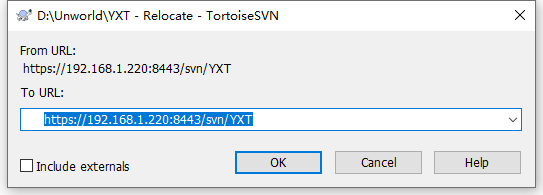
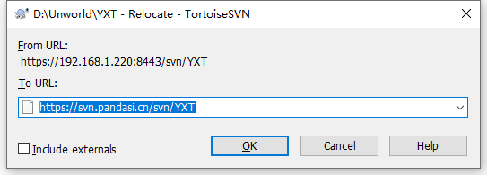
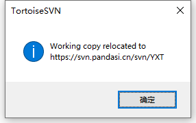
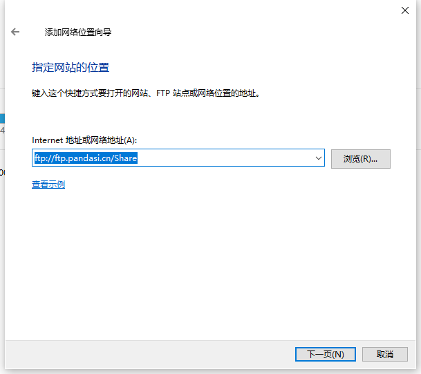
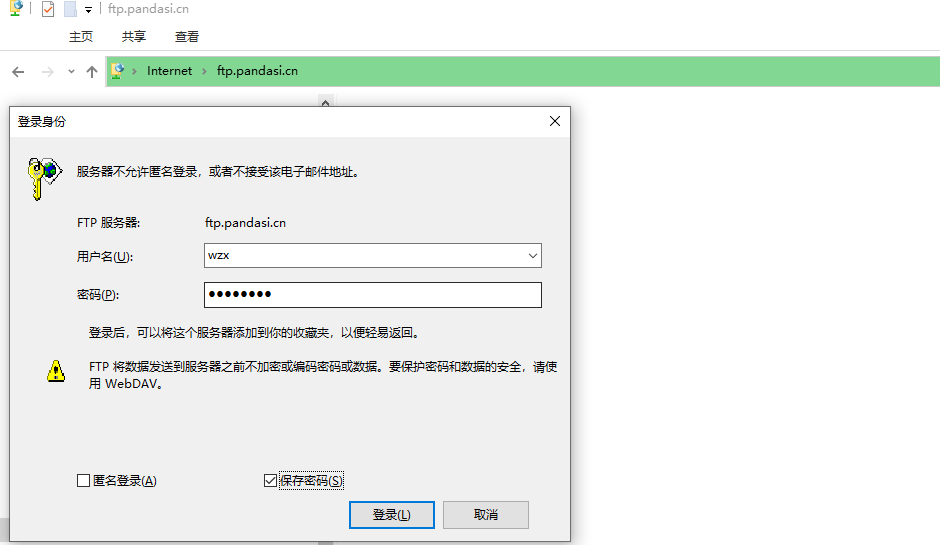

# SVN地址迁移

1. 项目**根目录**空白处右键菜单选择**TortoiseSVN**-->**Relocate...**。
   
2. To URL 填入外网或者内网地址。
   
   
3. 点击确定 ，弹出如下提示则成功。（working copy relocated to 目标地址）
   

# 群晖FTP

1. 我的电脑右键-->添加一个网络位置。
   或

2. 打开**添加网络位置向导**，下一步。

3. **选择自定义网络** 下一步。

4. 指定网站的位置，**Internet地址或者网络地址** 填入 **ftp://ftp.pandasi.cn/Share**，下一步直至结束。

5. 稍等片刻，出现此界面， 输入用户名密码，保存密码，登陆。
   

   

6. 外网访问速度比内网慢很多，耐心等待。

