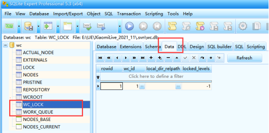

# TortoiseSVN使用教程

TortoiseSVN 是 Subversion 版本控制系统的一个免费开源客户端，可以超越时间的管理文件和目录。

------

[TOC]

## SVN简介	

Subversion(SVN) 是一个开源的版本控制系統, 也就是说 Subversion 管理着随时间改变的数据。 这些数据放置在一个中央资料档案库(repository) 中。 这个档案库很像一个普通的文件服务器, 不过它会记住每一次文件的变动。 这样你就可以把档案恢复到旧的版本, 或是浏览文件的变动历史。SVN 的一些概念

- **repository（源代码库）:**源代码统一存放的地方
- **Checkout（提取）:**当你手上没有源代码的时候，你需要从repository checkout一份
- **Commit（提交）:**当你已经修改了代码，你就需要Commit到repository
- **Update (更新):**当你已经Checkout了一份源代码，Update一下你就可以和Repository上的源代码同步，你手上的代码就会有最新的变更

## 软件安装

| 软件                                                         | 版本 |
| ------------------------------------------------------------ | ---- |
| [TortoiseSVN](Software/TortoiseSVN-1.14.1.29085-x64-svn-1.14.1.msi) | 1.14 |
| [LanguagePpack](Software/LanguagePack_1.14.1.29085-x64-zh_CN.msi) | 1.14 |

## 清理失败

1.安装软件

| 软件                                               | 版本 |
| -------------------------------------------------- | ---- |
| [TortoiseSVN](Software/SQLiteExpertProSetup64.exe) | 1.14 |

2.File->Open Database，选择目标SVN工程根目录 .svn\wc.db。
	.svn是隐藏文件夹，如果看不到，在文件夹选项中设置显示隐藏文件夹。

3.右侧页签选中Data，左侧列表分别选中WC_LOCK 和WORK_QUEUE，删除右侧表格里所有数据。

4.如果仍无法结局，重新检出项目。

