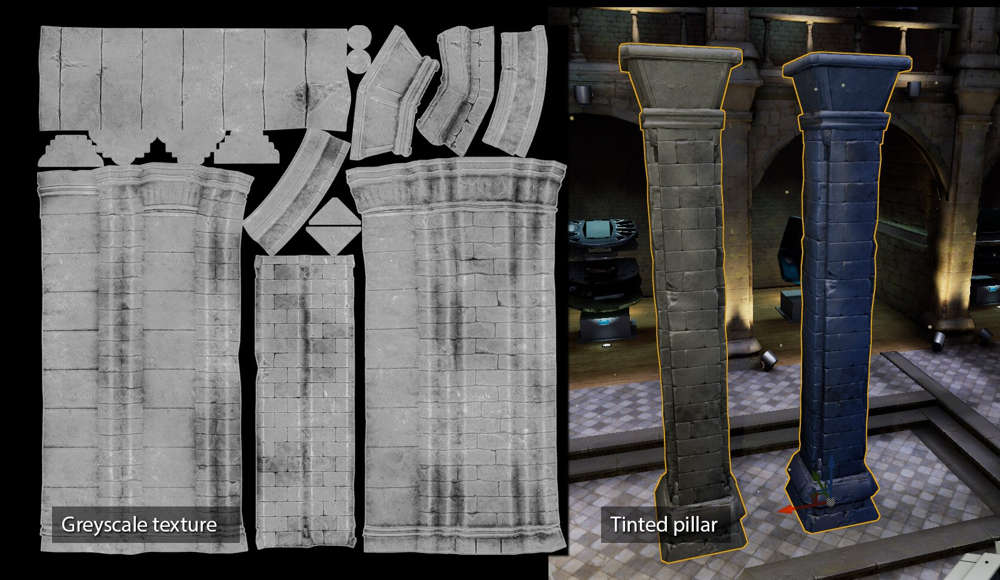
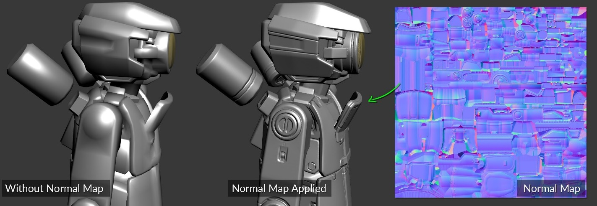

[TOC]

------

# 材质和着色器

## 什么是材质和着色器？

虚幻引擎中的 **材质（Materials）** 定义了场景中对象的表面属性。 从广义上来讲，你可以将材质视为涂在网格体上用来控制其视觉外观的"涂料"。更具体地说，材质能准确地告诉引擎某个表面应该如何与场景中的光源交互。材质定义了表面的各种特性，包括颜色、反射率、粗糙度、透明度等。

**着色器（Shader）**是一个小程序，它告诉 GPU 如何在屏幕上绘制对象以及在对象上进行所需的计算。

着色器具有一下先决条件：

- 着色器需要附加到使用的材质上
- 用于编写着色器的脚本语言，例如HLSL和GLSL

虚幻引擎根据所选目标平台使用最相关的移动着色器。与默认 Shader Model 5 相比，使用此移动着色器会产生不同的外观。为了更好地在编辑器中可视化设备的最终外观，请更改 Preview Rendering Level 为 **Android ES3.1**

## 纹理采样（Texture Smaplers）

对于移动平台，建议使用尽可能少的纹理。这是因为更多的纹理会导致更多的纹理提取，而额外的带宽会影响电池使用时间。此外，由于这些纹理保存在内存中，因此应用程序大小会增加。

移动平台上的材质（特征级ES 3.1）使用与其他平台相同的基于节点的创建过程。几乎所有的材质输入都可用于移动材质，而且在移动平台上，材质的外观和行为通常与在其他平台上相同。例如，以下材质输入在移动平台上与在PC上的运行方式完全相同。

### 移动平台上使用纹理采样的建议

- 由于硬件限制，只能使用**16**个纹理采样器。建议使用**不超5个**。
- 尽量减少纹理数量，可以使用纹理打包来减少纹理数量。例如，不要将单个纹理用于粗糙度或者金属度，而是将纹理打包到单个纹理的通道中。
- 对于一些参数，例如金属、粗糙度或平滑度，我们还可以使用数值而不是纹理。使用数值将进一步减少使用的纹理数量。

[^Note]: 4.23版已经弃用了OpenGL ES2。更早版本的虚幻引擎只能使用5个纹理采样器。

### 光照着色器（Default Lit）和无光照着色器（Unlit）

手机游戏中最常用的着色器是**光照着色器（Default Lit）**和 **无光照着色器（Unlit）**。使用无光照着色器来减少使用的纹理数量，因为材质不受光线影响，不需要粗糙度或金属纹理。

**Unlit** 是最快和最便宜的着色模型。如果您的目标是低端设备，请使用无光照着色器。

- 尽可能使用 **默认(Default Lit)**和**无光照(Unlit)**的着色模型**（Shading Model）**。

- 无光照着色模型不受光照影响，仅输出自发光作为颜色。

- 因为无光照着色器不受光照影响，所以不需要进行许多计算，例如镜面反射、阴影等。这种计算的减少导致更便宜和更快的渲染。

- 应使用[自定义UV](https://docs.unrealengine.com/4.27/zh-CN/RenderingAndGraphics/Materials/CustomizedUVs)来避免依赖性纹理获取（纹理UV上没有数学运算）。

  > [有关更多信息，请参阅适用于移动平台](https://docs.unrealengine.com/en-US/Platforms/Mobile/Materials/index.html)的虚幻引擎材质文档。

  与无光照着色器相比，默认光照着色器需要额外的处理。光照着色器需要更多处理，但是表面可能会受到光的影响并具有镜面反射。对于大多数游戏，着色模型使用的是光照着色器。

  

### 透明度

- 移动平台上，建议仅在必要时使用透明。 半透明和遮罩材质的消耗极高。建议尽量使用[半透明材质](https://docs.unrealengine.com/4.27/zh-CN/RenderingAndGraphics/Materials/MaterialProperties/BlendModes)。

- 在对象重叠渲染时，一个像素会被多次绘制，产生过度绘制现象，透明的层数越多，渲染成本越高。构建关卡时要注意，将透明材质的数量保持在最低。无法避免时，着色器逻辑尽量简单。

- 深度淡化可用于 **iOS平台** 的半透明材质。在硬件不支持从深度缓冲获取的平台上，不支持该功能，模拟该功能会导致不可接受的性能消耗。

>

### 顶点着色器的操作

项目中最常用的着色器是顶点着色器和像素着色器的组合。顶点着色器适用于每个顶点，像素着色器适用于每个像素。通常渲染的像素多于屏幕上的顶点数，这意味着像素的计算量将多于顶点。建议尽可能将计算从像素着色器转移到顶点着色器。

在使用虚幻引擎中的自定义 UV 功能进行优化后，我们需要进行进一步的分析。然后我们连接节点并使用像素着色器中的纹理坐标节点来定位自定义的 UV。

> 自定义UV https://docs.unrealengine.com/4.27/zh-CN/RenderingAndGraphics/Materials/CustomizedUVs/

### 减少不必要的数学运算

我们在着色器中使用数学运算来自定义外观和行为。例如，乘法、加法、幂、下限和对数。

这些数学运算在性能成本方面并不相等；因此，我们需要注意它们的使用。一些成本更高的操作是 **sin、pow、cos、divide 和 noise**。加法和乘法等基本运算通常更快。尽量减少昂贵的数学运算的数量。这个数字在旧设备上尤其需要保持较低，例如具有 GLES 2.0 的设备。

### 移动平台不支持的功能

- 场景颜色表达式
- 曲面细分输入
- 次表面散射着色模型

### 移动平台特定的材质设置

| 属性                                       | 说明                                                         | 备注                             |
| :----------------------------------------- | :----------------------------------------------------------- | -------------------------------- |
| **bFullyRough**                            | 启用后，可节省大量着色器ALU指令和一个采样器。这可以有效禁用高光（Specular），同时保持整体反射能量。 |                                  |
| **高质量反射（High Quality Reflections）** | 在前向渲染器中启用高质量反射。启用该设置可减少材质可用的采样器数量，因为反射立方体贴图将使用另外两个采样器。 |                                  |
| **bUseLightmapDirectionality**             | 禁用后，光照图中的光照将会比较平淡，但开销更低。             |                                  |
| **使用全精度（Use Full Precision）**       | 启用后，材质的着色器会使用移动设备上可用的最高精度数学。这可用于迂回解决低精度数学造成的渲染问题，例如世界坐标的使用或光滑材质之上的密集镜面反射 | 启用全精度着色器会提高材质开销。 |
|                                            |                                                              |                                  |

# 纹理(Texture)

**纹理**是在材质中使用的图像。它们被映射到应用材质的表面。要么直接应用纹理 - 例如，对于 Base Color 纹理 - 要么纹理像素（或*texels*）的值在材质中用作蒙版或用于其他计算。在某些情况下，纹理也可以在材质之外直接使用，例如用于绘制到 HUD。**大多数情况下，纹理是在图像编辑应用程序（如 Photoshop）中从外部创建的，然后通过内容浏览器**导入虚幻编辑器。但是，一些纹理是在 Unreal 中生成的，例如渲染纹理。这些通常从场景中获取一些信息并将其渲染到纹理以在其他地方使用。

一种材质可以使用多个纹理，这些纹理都经过采样并应用于不同的目的。例如，一个简单的材质可能有一个 Base Color 纹理、一个 Specular 纹理和一个法线贴图。此外，在这些纹理中的一个或多个的 Alpha 通道中可能存储了 Emissive 和 Roughness 的映射。

## 纹理图集(Texture atlasing)

纹理图集是包含来自已打包在一起的多个较小图像的数据的图像。可以使多个网格共享的更大纹理，而不是为每个网格提供一个纹理。
可以在制作资源之前创建纹理图集，这意味着根据纹理图集对资源进行[UV 展开。这需要在创建纹理时进行一些早期规划。

纹理图集支持对共享此纹理图集和相同材质的多个静态对象进行批处理。批处理减少了绘制调用的数量。当游戏受 CPU 限制时，更少的绘制调用会带来更好的性能。

在虚幻引擎中，批处理需要手动完成。您可以通过在 3D 软件工具中合并对象或使用 UE4 Actor Merging 工具来执行批处理。UE4 Actor Merging 工具还会自动创建纹理图集。更多信息可以在虚幻引擎文档中的 Actor Merging 中找到。

## 纹理过滤(Texture filtering)

纹理过滤是一种用于提高场景中纹理质量的方法。如果没有纹理过滤，像锯齿这样的伪影通常看起来更糟。
纹理过滤使纹理看起来更好，更少块状。通常，这会使游戏看起来更好。
但是，纹理过滤也会降低性能。这是因为更好的质量通常意味着需要更多的处理。在性能和视觉质量之间找到良好的平衡很重要。
纹理过滤最多可占 GPU 能耗的一半。选择更简单的纹理过滤器可以降低应用程序的能量需求。

主流的游戏引擎中有几个用于纹理过滤的选项：

- 最近（Nearest）。 近距离观察时，最近的过滤会使纹理看起来像块状。这是最简单和最便宜的纹理过滤。
- 双线性（Bi-linear）。使用双线性过滤，纹理在近距离变得更模糊。对最近的四个纹理像素进行采样，然后对其进行平均以为主像素着色。与最近过滤不同，双线性过滤会产生较少的块状像素，因为像素具有平滑的梯度
- 三线性（Tri-linear）。三线性过滤类似于双线性过滤，但在 mipmap 级别之间添加了混合。三线性过滤通过平滑 mipmap 之间的过渡来消除 mipmap 之间的显着变化。

### 纹理过滤最佳实践

Arm 建议您尝试以下纹理过滤技巧：

- 使用双线性过滤在性能和视觉质量之间取得平衡。
- 有选择地使用三线性过滤。这是因为三线性滤波比双线性滤波需要更多的内存带宽。
- 过滤器的组合可能比使用三线性过滤器看起来和执行得更好。

## Texture mipmapping

Mipmap 是以较低分辨率保存的原始纹理的副本。您可以将 mipmapping 视为相当于细节级别 (LOD)，但适用于纹理。
根据片段占用的纹理空间大小，您可以选择合适的采样级别。当对象离相机较远时，将应用较低分辨率的纹理。当物体靠近相机时，应用更高分辨率的纹理。下图显示了一个 mipmap 集合，其中包含不同分辨率的相同纹理：

### Mipmap 最佳实践

确保使用 mipmapping。这是因为 mipmapping 提高了性能和质量。Mipmapping 提高了 GPU 的性能。这是因为 GPU 不需要在远离相机的物体上渲染全分辨率纹理。

Mipmapping 还可以减少纹理混叠并提高最终图像质量。纹理混叠会在远离相机的区域产生闪烁效果。下图显示了使用和不使用 mipmapping 的同一纹理上的纹理锯齿：

在虚幻引擎中，要生成 mipmap，请使用 2 次方的纹理比率，例如 512x1024、128x128、2048x2048 等。当纹理比率不是 2 的幂时，虚幻引擎不会生成 mipmap 链。纹理不需要是正方形的，例如，虚幻引擎将为 512 x 1024 纹理生成 mipmap。

## 纹理大小、色彩空间和压缩

纹理大小、色彩空间和压缩都会对游戏性能产生影响。

### 纹理大小

- 只创建满足所需质量的纹理，尽可能最小。使用纹理图集在多个网格之间共享纹理也是最佳的实践。
- 纹理可以是不同的大小。减小需要较少细节的某些纹理的大小有助于减少带宽。例如，漫反射纹理可能是 1024x1024 像素，而粗糙度或金属贴图可能是 512x512 像素。
- 有选择地减小纹理大小，然后检查视觉冲击是否已经下降。

虚幻引擎提供了可以帮助您管理纹理大小的统计工具。统计工具显示有关项目中不同资产的数据。这有助于您检查您的资产是否在预算范围内，并快速识别不在预算范围内的资产。（Statustucs 窗口）

### 纹理色彩空间

大多数纹理软件，例如 Adobe Photoshop 或 Substance Painter，都使用 sRGB 颜色空间进行工作和导出。

建议您尝试以下方法：

- 在 sRGB 颜色空间中使用漫反射纹理。
- 未作为颜色处理的纹理不得位于 sRGB 颜色空间中。示例包括金属贴图、粗糙度贴图和法线贴图。这是由于以下原因：
- - 地图用作数据，而不用作颜色。
  - 在这些贴图中使用 sRGB 会导致材质出现错误的外观或视觉效果。

**注意：纹理的Inspector 窗口**中的**sRGB（颜色纹理）**设置不得勾选粗糙度、镜面反射、法线贴图或类似贴图，如下图所示。

### 纹理压缩

纹理压缩是一种图像压缩，用于减少纹理数据大小，同时最大限度地减少视觉质量的损失。在开发中，我们使用通用格式（如 TGA 或 PNG）导出纹理。这些格式使用起来更方便，各大图像软件程序都支持。

这些格式不得用于最终渲染。这是因为与专门的图像格式相比，它们的访问和采样速度都较慢。对于 Android，有几个选项，例如 Adaptive Scalable Texture Compression (ASTC) 和 Ericsson Texture Compression (ETC) 2。

我们建议您使用 Arm 创建的 ASTC 技术。这里有几个使用 ASTC 的理由：

- ASTC 在与 ETC 相同的内存大小下提供更好的质量。
- ASTC 以比 ETC 更小的内存大小产生相同的质量。
- ASTC 的编码时间比 ETC 长。这意味着游戏打包过程可能需要更多时间。如果这是一个问题，那么最好在游戏的最终包装上使用 ASTC。
- ASTC 允许在质量方面进行更多控制，因为 ASTC 允许设置块大小。虽然块大小没有单一的最佳默认值，但将块大小设置为 5x5 或 6x6 像素是一个很好的起点。

有时，如果您必须在设备上快速部署游戏，使用 ETC 进行开发可能会更快。您可以使用具有快速压缩设置的 ASTC 来避免部署时间的增加。编码时，可以选择在速度与质量和大小之间进行权衡。对于最终构建，就视觉质量和文件大小之间的平衡而言，ASTC 是最佳选择。

当您打包游戏时，游戏引擎会处理纹理压缩。但是，您可以选择使用哪种压缩技术。您必须选择要使用的格式，因此很难跳过此步骤。

虚幻引擎提供了一项功能，可以将游戏与所有纹理格式打包，然后在运行时根据设备选择要使用的格式。这会产生更大的打包文件，但可以避免兼容性问题。

要在虚幻引擎中使用 ASTC，请使用**平台**设置。在**纹理格式属性**下，将**ASTC 纹理格式优先级**设置为较高的值，例如 0.8 或 1。如果设备支持，这可确保您的项目使用 ASTC 而不是 ETC。以下屏幕截图显示了在虚幻引擎中构建 Android 包时如何选择 ASTC：

要控制 ASTC 块大小，请转到**项目设置中的Cooker**设置。在**TEXTURES**选项卡上，为项目的压缩配置**Speed**和**Size**设置。我们建议从**Speed** 1和**Size** 3 开始，但要通过试验来发现最适合您的项目的方法。UI

## 展UV

展UV 是创建 UV 贴图的过程。UV 贴图将 2D 纹理投影到 3D 模型的表面上。
最佳做法是使 UV islands  尽可能笔直。

[^Note]: UV island 是纹理贴图中的一组连接的多边形。

保持 UV island 尽可能笔直的原因是：

- 打包 UV island 更容易，节省空间。
- 拉直UV可以减少纹理上发生的[阶梯效应。](https://en.wikipedia.org/wiki/Jaggies)
- 在移动平台上，纹理空间是有限的。这是因为移动平台上的纹理尺寸通常比游戏机或 PC 上的要小。良好的 UV 包装可确保您从纹理中获得最佳分辨率。
- 可能会考虑通过保持 UV 笔直来使 UV 略微扭曲，以便获得更好的整体纹理质量。

## 视觉效果

创建纹理时包含的细节应与该细节的视觉影响成比例。确保您只创建可以看到的细节。
手机屏幕很小，因此看不到细粒度的细节。在创建纹理时要考虑到这一点。例如，对于在房间角落几乎看不到的椅子，您不需要具有大量细节的 4K 纹理。

使用更少的纹理并将任何额外的细节烘焙到一个纹理中。这很重要，因为：

- 手机屏幕很小，一些细节最好烘焙到漫反射纹理本身上，以确保这些细节可见。
- 可以烘焙环境光遮蔽和小镜面高光等元素，然后将其添加到漫反射纹理中。

这种方法意味着您不必过多依赖着色器和引擎功能来获得镜面反射和环境光遮蔽。

如果可能，请使用允许在着色器中着色的灰度纹理。这以创建自定义着色器来执行着色为代价来节省纹理内存。

使用这种技术要有选择性，因为并非所有对象都使用这种方法看起来很好。将此技术应用于具有统一或相似颜色的对象会更容易。

您还可以使用 RGB 蒙版，然后应用基于蒙版颜色范围的纹理来实现此效果。

下图显示了应用于着色柱的灰度纹理示例：

## 纹理通道打包

使用纹理通道将多个纹理打包为一个。

建议使用纹理通道打包，因为打包有助于节省纹理内存。打包可以节省内存，因为您可以使用此技术将三个贴图合并到一个纹理中。这意味着需要更少的纹理采样器。

这种纹理填充技术通常用于将粗糙度或平滑度和金属填充到一个纹理中。但它可以应用于任何纹理贴图。

使用绿色通道存储更重要的掩码。绿色通道通常有更多位。这是因为我们的眼睛对绿色更敏感，对蓝色不太敏感。粗糙度/平滑度贴图通常比金属贴图更详细，应放置在绿色通道中。将这些贴图的纹理设置为线性/RGB 而不是 sRGB 颜色空间。

> [可以在此处找到](http://hyperphysics.phy-astr.gsu.edu/hbase/vision/colcon.html)有关颜色敏感锥体的进一步阅读。

下图显示了纹理打包的示例：

## Alpha通道

向纹理添加 Alpha 通道时要有选择性。添加透明度通常会使纹理文件大小变大，因为图像被转换为 32 位格式，从而增加了整体带宽使用。

存储 Alpha 通道的另一种方法是在粗糙度或金属纹理中使用额外的通道，而不是在漫反射纹理中添加 Alpha 通道。在 Unreal 中，这些纹理通常只使用三个通道中的两个：粗糙度 (G) 和金属 (B)，使 (R) 通道空闲。环境遮挡贴图通常可以在漫反射贴图中烘焙。

通过使用空闲通道存储 Alpha 蒙版，您可以将漫反射纹理保持在 16 位，从而将文件大小减半。

下图显示了如何在红色通道中存储不透明度贴图的示例：

## 法线贴图最佳实践

法线贴图是使 3D 对象看起来具有更多细节的好方法。法线贴图最适合添加较小的细节，如皱纹、螺栓和其他需要大量三角形来建模的细节。

法线贴图的使用取决于游戏的类型和艺术方向。

在我们的大多数内部项目中，我们使用法线贴图，性能没有明显下降。因为我们的大多数演示都针对高端设备，所以低端设备可能会产生不同的结果。

使用法线贴图确实会带来成本，即使成本很小。记住：

法线贴图是一种额外的纹理。这意味着更多的纹理提取，从而导致使用更多的带宽。针对低端设备时，请谨慎使用法线贴图。

下图显示了如何将法线贴图和纹理用于较小细节的示例：

## 法线贴图烘焙

# 优化内存带宽

与Window系统中的 GPU 相比，移动设备中的内存带宽非常有限。它很容易成为限制应用程序性能的瓶颈。出于这个原因，尽量减少内存带宽的使用。

- 带宽是一种共享资源，因此使用过多会以不可预知的方式限制整个系统的性能。例如，图形内存与应用程序内存共享，因此 GPU 的高带宽使用会降低应用程序处理器的性能。
- 访问外部存储器需要大量功率，因此减少带宽使用可降低功耗。
- 访问高速缓存中的数据可降低功耗并提高性能。如果您的应用程序必须大量从内存中读取，请使用 mipmapping 和纹理压缩等技术来确保您的数据是缓存友好的。请参阅[*使用 mipmapping*](https://developer.arm.com/documentation/dui0555/b/bandwidth-optimizations/use-mipmapping?lang=en)，并参阅[*使用纹理压缩*](https://developer.arm.com/documentation/dui0555/b/bandwidth-optimizations/use-texture-compression?lang=en)。

### 确定内存带宽是否处在瓶颈？

内存带宽影响广泛，比较难直接观测，所以比较难判断是否处在瓶颈。
带宽过度使用似乎是处理器中的其他限制。如果其中一个人处理器限制了性能并且优化似乎没有效果。则可能是带宽的问题。
如果应用程序受带宽限制，问题很可能是：

- Textures.
- Overdraw.

# Mesh的最佳实践

## 三角形和多边形的使用

建议您使用尽可能少的三角形来获得创建对象所需的质量。在为移动平台创建内容时，三角形的数量应该是首先要考虑的事情之一。

更少的三角形将通过以下方式帮助提高性能：

- GPU（图形处理单元）处理的顶点更少
- 处理顶点是昂贵的。处理的顶点数量越少，整体性能就会提高。

更少的三角形意味着游戏可以在更多设备上发布，而不仅仅是拥有最强大 GPU 的设备。

在您的目标设备上查看和测试游戏，不要使用显示器。使用许多三角形创建的某些细节在手机上可能看不到。

### 前景和背景对象

在靠近相机的前景物体上使用更多的三角形，在背景物体上使用更少的三角形。

模型上使用的最大三角形数量取决于以下因素：

- 游戏中一次可见的对象数量。多个可见对象的三角形数量较少，但如果只有两个或三个可见对象，我们可以使用更多的三角形。
- 目标设备。三星 Galaxy S 系列等较新的智能手机可以处理比旧移动设备更复杂的几何形状。

### 分布三角形

多边形或顶点在移动平台上非常昂贵。通过将多边形放置在有助于游戏视觉质量的区域中，不会浪费处理预算。
在创建细节时，重要的是要考虑到 3D 对象上的小三角形细节在游戏的最终屏幕上是不可见的。这些细节受到小手机屏幕尺寸和游戏关卡中 3D 对象放置的影响。
不要使用高密度三角形网格对复杂的细节进行建模，而是使用纹理和法线贴图来获得精细的细节。下图显示了带有和不带有法线贴图的网格示例：

在从相机角度看不经常看到的区域（例如汽车底部或衣柜后部）使用较少的三角形。您也可以删除这些区域，但是，请小心删除区域，以防您需要重新使用场景。例如，如果删除表格网格的底部，则不能将其倒置。

### 不要使用微三角形

微三角形是太小而无法对物体或最终场景的视觉做出贡献的三角形。手机屏幕上的微三角形小于 1 到 10 个像素。GPU 会处理这些三角形，即使它们对对象没有好处。我们建议三角形面积大于 10 像素。

顶点的处理成本很高，小三角形会导致更多的顶点。这种处理也会影响内存带宽，因为有更多的数据需要发送到 GPU。在移动设备上，GPU 处理会影响电池寿命，因此用户无法长时间玩游戏。
此外，当这些对象远离相机时，具有高多边形数的 3D 对象会遇到微三角形问题。

微三角形可能由以下原因引起：

- 细节太小且由许多三角形组成
- 距离相机较远的物体，带有许多三角形

不要使用许多多边形对细节进行建模。相反，使用纹理和法线贴图来获得这种精细的细节。您还可以合并太小的顶点或三角形。

在下图中，绿色正方形区域中的三角形太小，无法在手机屏幕上看到：

如果对象距离相机较远，请使用 LOD 降低复杂性。LOD 使对象更简单，并且三角形的密度更低。在下图中，左侧的角色使用较少的三角形并利用法线贴图获得更精细的细节：

### 不要使用细长的三角形

细长的三角形小于 10 像素，在最终图像中渲染时跨越屏幕。不要使用细长的三角形，因为与普通三角形相比，它的处理成本通常更高。

例如，从远处看，细长的三角形是柱子上的斜面。如果近距离观察，这些斜面不是问题，如下图所示：

我们建议对三角形采用以下最佳做法：

- 如果可能，移除物体上的细长三角形。
- 不要在带有细长三角形的物体上使用闪亮的材料，因为这会导致闪烁。
- 使用 LOD 并在距离较远时移除细长三角形。
- 保持三角形接近等边，以使对象具有更多的内部区域和更少的边缘。有关详细信息，请参阅[三角剖分](http://www.humus.name/index.php?page=News&ID=228)。
- 由于三角形非常薄，当相机稍微移动时，它要么使三角形接触采样点，要么错过该点。因此，片段并不总是被渲染并且在最终图像中看起来闪烁。

## LOD

随着物体远离相机，我们可以在该物体中看到更少的细节。例如，在 20 米外很难看出由 200 个三角形组成的物体和由 2000 个三角形组成的物体之间的区别。使用更少的三角形可以提高性能，因为需要处理的三角形更少。

 LOD具有以下优势：

- 随着物体与观察者的距离越来越远，降低网格复杂性
- 减少需要处理的顶点数量，避免出现微三角形
- 有助于缓解由微三角形引起的问题，如[不要使用微三角形中所述](https://developer.arm.com/documentation/102695/0100/Triangle-and-polygon-usage?lang=en#micro)
- 帮助放置在场景中更远的对象看起来更好。

使用 LOD 时，请关注对象的轮廓。LOD 也可以应用于着色器的复杂性，为更远的对象优化着色器和材质。例如，通过减少使用的纹理数量。移除较平坦区域的多边形并使用 mipmap 作为纹理的 LOD。

我们建议不要在以下情况下使用 LOD：

- 在摄像机视图是静态的且对象也是静态的游戏中
- 在已经很简单的对象或三角形计数较低的对象上

LOD 带有内存开销，因此文件大小更大。LOD 网格数据需要保存在内存中。

### 减少每个 LOD 上的三角形

我们建议您将级别之间的三角形数量减少 50%，如下图所示：

当物体距离较远时，不要在较低 LOD 上使用非常密集的三角形。
测试 LOD，因为它们将在距相机正确的距离处被看到。在近距离观看时，较低的 LOD 可能看起来不对，但在预期距离上看起来很好。
多边形减少太少会影响性能改进，因为渲染的三角形数量相似。过多的多边形减少和弹出在 LOD 开关上更加明显。

### 在对象上设置 LOD

对象上的 LOD 量取决于对象的大小和对象的重要性。例如，动作游戏中的角色或赛车游戏中的汽车比小背景对象（如树）具有更高的 LOD 级别。

如果 LOD 太低，会出现以下情况：

- 如果层之间的多边形减少不显着，则性能提升不明显
- LOD 开关上的弹跳可能更明显。

如果 LOD 太高，会出现以下情况：

- 额外的 CPU 工作负载，因为需要处理来决定显示哪个 LOD
- LOD 网格需要内存来存储额外的网格并增加文件大小
- 如果 LOD 模型是由艺术家手动创建的，则创建和验证 LOD 模型所需的时间会增加

### 创建 LOD 网格

要在 3D 软件中手动创建 LOD 网格，请移除边循环或 3D 对象上的顶点数。这为艺术家提供了更多控制权，但可能需要更长的时间来完成。

要自动创建 LOD 网格，请使用以下方法之一：

- 虚幻 LOD 生成功能可创建和应用 LOD 网格。这些功能使您能够将 LOD 应用于单个网格或在导入网格时自动创建 LOD。有关设置这些功能的更多信息，请参阅[自动 LOD 生成](https://docs.unrealengine.com/4.26/en-US/WorkingWithContent/Types/StaticMeshes/HowTo/AutomaticLODGeneration/)。
- 3D 包中的修改器，例如 3DSMax 中的 ProOptimizer 或 Maya 中的 Generate LOD Meshes。
- 一个 LOD 生成软件，例如 Simplygon 和 InstaLOD

### 其他几何最佳实践

#### 平滑组

#### 网状拓扑

### 网格注意事项

向移动 VR 游戏添加网格时的注意事项。

创建用于移动 VR 项目的网格时，必须牢记以下信息，以确保您创建的内容适用于移动 VR：

- 在 3D 网格上使用尽可能少的材质 ID，以节省绘制调用。
- 确保使用静态网格 LOD。
- 尽量减少 3D 网格的多边形数量。
- 确保所有静态模型都有第二个 UV 集，以便它们可以使用光照贴图。
- 使用 imposter sprite 替换远处的静态网格物体。
