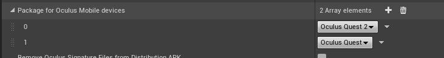

# 移动平台

[TOC]

## Android开发

### 1.软件安装

| 软件                                                         | 版本                     |
| :----------------------------------------------------------- | :----------------------- |
| [Android Studio](Software/android-studio-2021.1.1.21-windows.exe) | 4.0不是必须              |
| [java JDK 1.8](Software/jdk-8u202-windows-x64.exe)           | (必须1.8版本,太高会报错) |

Android Studio 安装完成后打开 Android SDK Manager 并选择要安装的SDK。

|         SDK Platforms         | SDK Tools（启用Show Package Details选项） |
| :---------------------------: | :---------------------------------------: |
| Android 5.0/5.1/9.0/10.0/11.0 |  Android SDK Build-Tools  29.0.2/30.0.3   |
|                               |     NDK（Side by side） 21.4.7075529      |


### 2.配置 Android SDK

- ProjectSettings->Platforms->Android SDK->SDKCOnfig
  特别注意：NDK路径需要选择到具体的版本号文件夹 C:/Users/Adnim/AppData/Local/Android/Sdk/ndk/21.4.7075529


- Package game data inside.apk? 设置为true


### 3.Oculus Quest  2打包配置

- Oculus Quest  Settings -->Start in VR
  

- Package for Oculus Mobile devices 添加 Oculus Quest 2选项.
  

> [Creating Your First Oculus Quest VR App in UE4](https://developer.oculus.com/documentation/unreal/unreal-quick-start-guide-quest/ )


UE5额外需要额外安装  [windowsdesktop-runtime-3.1.22-win-x64.exe ](Z:\Markdown\Software\windowsdesktop-runtime-3.1.22-win-x64.exe)和 [dotnet-runtime-5.0.7-win-x64.exe](Z:\Markdown\Software\dotnet-runtime-5.0.7-win-x64.exe)

[UE5]: https://forums.unrealengine.com/t/ue5-early-access-android-sdk-version/234341

重启虚幻引擎。

[UE：UPL 与 JNI 调用的最佳实践](https://imzlp.com/posts/27289/)

安卓打包禁止锁屏
修改引擎的GameActivity.java.template ，路径是 [Engine\Build\Android\Java\src\com\epicgames\ue4\GameActivity.java.template](D:\Program Files\Epic Games\UE_4.26\Engine\Build\Android\Java\src\com\epicgames\ue4\)

将

```java
// restore screensaver state
AndroidThunkJava_KeepScreenOn(bKeepScreenOn)
```

 改为 

```java
AndroidThunkJava_KeepScreenOn(true)
```

### 3.Steam VR项目配置

| 软件                                                         | 版本                          |
| ------------------------------------------------------------ | ----------------------------- |
| [Oculus 客户端](\\192.168.100.199\home\Markdown\Software\OculusSetup.exe) | 38.0.0.51.727 (38.0.0.51.727) |
| [Oculus Developer Hub](\\192.168.100.199\home\Markdown\Software\Oculus Developer Hub Setup 2.2.0.exe) | 2.2.0                         |
| SteamVR                                                      | PC Steam 客户端, 安装SteamVR  |

1. 安装 [Oculus 客户端](\\192.168.100.199\home\Markdown\Software\OculusSetup.exe) ，同一FB账号登陆，并在VR 头显内开启开发者选项。

2. 安装SteamVR。

3. Oculus Quest 2 头显内 进入Oculus Link。并启动SteamVR，保证StreamVR识别到设备。

4. 启动UE4项目，Play 下拉框内 VR Preview 可用。

5. 如果需要打包至一体机。则需要安装 [Oculus Developer Hub](\\192.168.100.199\home\Markdown\Software\Oculus Developer Hub Setup 2.2.0.exe) ，参考 [Oculus Quest 2.md](\\192.168.100.199\home\Markdown\Oculus Quest 2.md)。

   > https://developer.oculus.com/documentation/unreal/unreal-quick-start-guide-quest/

Oculus Quest 2 需要安装 Oculus 客户端，和 Oculus Developer Hub， 

## 像素流送

1. 开启Pixel streaming 插件
2. 进入引擎安装目录
   [D:\Program Files\Epic Games\UE_4.27\Samples\PixelStreaming\WebServers\SignallingWebServer\platform_scripts\cmd](D:\Program Files\Epic Games\UE_4.27\Samples\PixelStreaming\WebServers\SignallingWebServer\platform_scripts\cmd)
3. 命令行 执行 get-executionpolicy，如果结果是Restricted，那表示禁止执行脚本
   执行如下命令，降低系统的安全性，允许执行脚本：set-executionpolicy -executionpolicy unrestricted
4. 管理员身份运行powershell   .\setup.ps1  和 .\Start_SignallingServer.ps1

## 性能优化

### CPU

1. DC（DrawCall）：CPU会向GPU发送许多的数据指令去描绘当前形形色色的几何体，着色。每发送一次绘制称为一次DC（DrawCall）
   		不合理的使用资源会造成DC的急剧增加，造成CPU不堪重负，以为CPU每次开拓一个新的DC都需要经过很多准备工作，检查渲染对象，提交渲染数据等等，此时GPU处于闲置状态，CPU累死， GPU闲死。
      		一般移动端的 DC保持在100-150以下，
      		减少模型的材质数量，尽量复用材质球，UI Atlas，合并Mesh、合并贴图、在母材质球中使用不同材质或者使用合并后的材质，通过参数控制。使用材质参数集。static mesh component instance

 

### CPU+GPU

骨骼模型：移动端20-30
https://docs.unrealengine.com/4.27/zh-CN/SharingAndReleasing/Mobile/Performance/

https://docs.unrealengine.com/4.27/zh-CN/SharingAndReleasing/Mobile/Performance/TipsAndTricks/

https://docs.unrealengine.com/4.27/zh-CN/SharingAndReleasing/XRDevelopment/VR/VRPerformanceAndProfiling/PerformanceFeatures/

https://developer.arm.com/documentation/100959/0101/Introduction

https://docs.unrealengine.com/4.27/zh-CN/SharingAndReleasing/Mobile/Materials/


