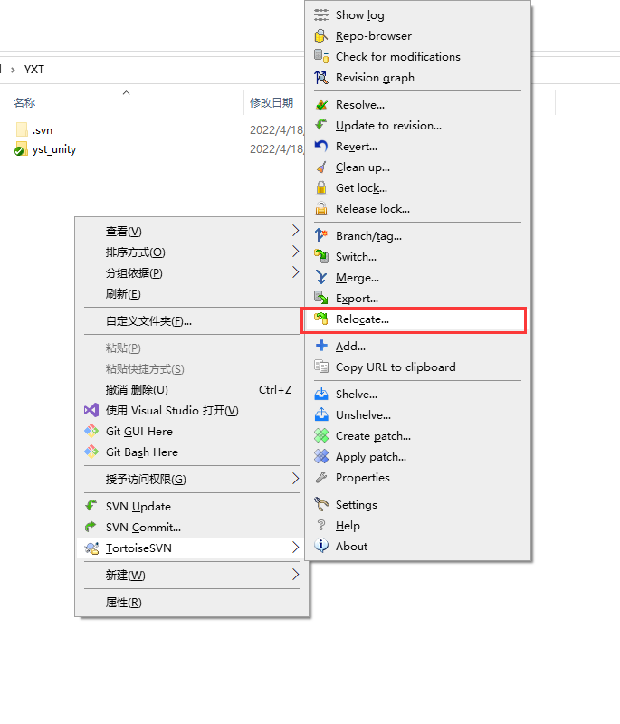
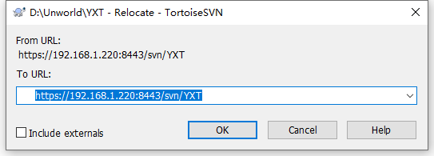
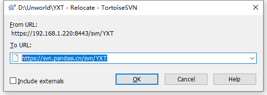
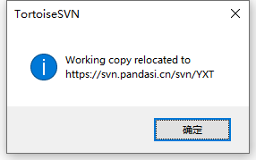
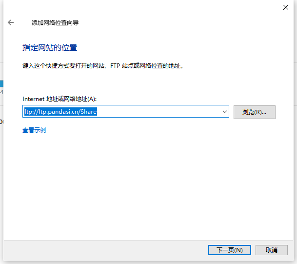
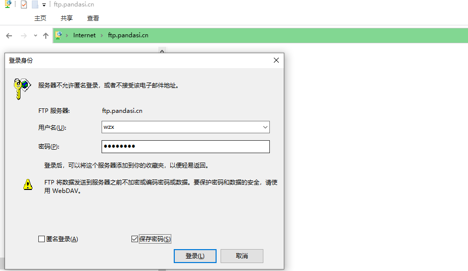
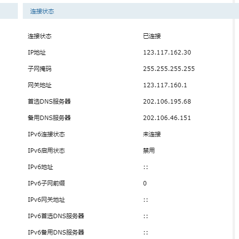

---

title:  "项目工程地址"
date:   2022-04-28 14:15:09 +0800
categories: 项目管理
---
# 项目地址

| 工程名          | 地址(内网)                                       | 地址(外网)                                        |
| --------------- | ------------------------------------------------ | ------------------------------------------------- |
| 寻龙诀          | https://192.168.1.220:8443/svn/XunLongJue/       | https://svn.pandasi.cn:8443/svn/XunLongJue        |
| 群星            | https://192.168.1.220:8443/svn/QunXingShanYaoShi | https://svn.pandasi.cn:8443/svn/QunXingShanYaoShi |
| 惠普            | https://192.168.1.220:8443/svn/HP_4_13           | https://svn.pandasi.cn:8443/svn/HP_4_13           |
| 荧惑            | svn://192.168.100.199/YingHuoGuiTu               | svn://svn.pandasi.cn:3690/YingHuoGuiTu            |
| 阴阳师2022      | https://192.168.1.220:8443/svn/YYS_2022          | https://svn.pandasi.cn:8443/svn/YYS_2022          |
| xiaolan直播     | https://192.168.1.220:8443/svn/YLZB/YLKJ         | https://svn.pandasi.cn:8443/svn/YLZB/YLKJ         |
| 公司插件Plugins | svn://192.168.100.199/Plugins                    | svn://svn.pandasi.cn:3690/Plugins                 |
| 群晖FTP         | ftp://192.168.100.199/Share                      | ftp://ftp.pandasi.cn/Share                        |
| 超速心律FPT     | ftp://192.168.1.88/                              | ftp://ftp.pandasi.cn:8821/                        |

# SVN地址迁移

1. 项目**根目录**空白处右键菜单选择**TortoiseSVN**-->**Relocate...**。
   
2. To URL 填入外网或者内网地址。
   
   
3. 点击确定 ，弹出如下提示则成功。（working copy relocated to 目标地址）
   

# 群晖FTP

1. 我的电脑右键-->添加一个网络位置。
   或

2. 打开**添加网络位置向导**，下一步。

3. **选择自定义网络** 下一步。

4. 指定网站的位置，**Internet地址或者网络地址** 填入 **ftp://ftp.pandasi.cn/Share**，下一步直至结束。

5. 稍等片刻，出现此界面， 输入用户名密码，保存密码，登陆。
   

   

6. 外网访问速度比内网慢很多，耐心等待。

